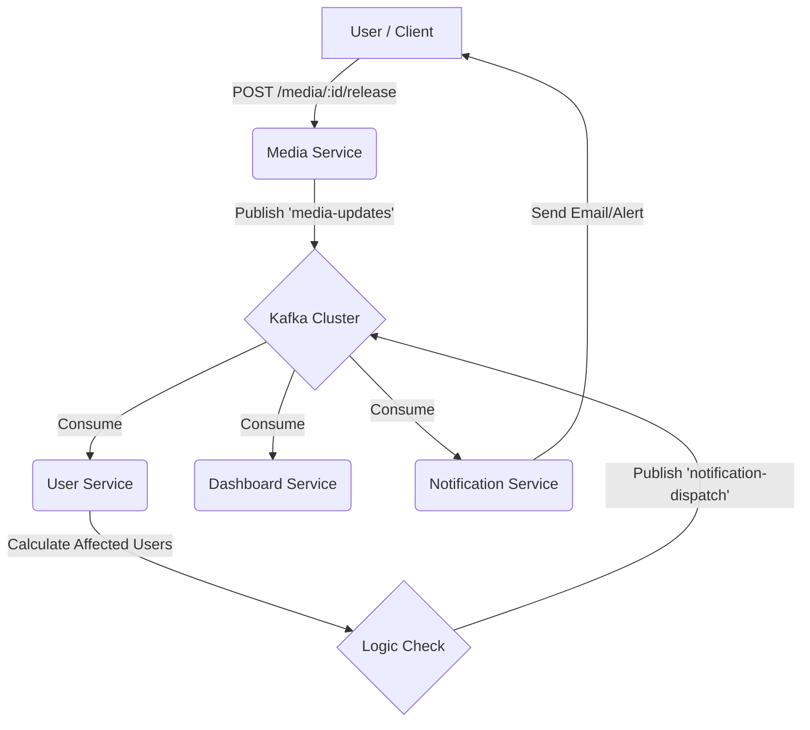

# Kafka Architecture & Cheatsheet

## Event Architecture (Pub/Sub & Fan-Out)

The project uses a **Publish-Subscribe (Pub/Sub)** architecture to decouple services. Events are broadcasted to topics, and interested services ("consumers") subscribe to them.

### High-Level Data Flow



### Topic 1: `user-registered`
*   **Producer:** `user-service`
    *   **Trigger:** New user registration.
*   **Consumer A:** `media-service` (Creates default watchlist).
*   **Consumer B:** `notification-service` (Sends welcome email).
*   **Pattern:** Simple Fan-Out.

### Topic 2: `media-updates` (The "New Content" Flow)
*   **Producer:** `media-service`
    *   **Trigger:** `POST /media/{id}/release` (Admin/System action).
    *   **Payload:** 
        ```json
        { 
          "event_type": "new_release", 
          "media_id": "...", 
          "media_title": "...", 
          "media_type": "Series|Book|...",
          "release_title": "...",
          "season": 2,      // Optional (Series)
          "episode": 5,     // Optional (Series)
          "volume": 1,      // Optional (Book/Manga)
          "chapter": 12     // Optional (Book/Manga)
        }
        ```
*   **Consumer A:** `dashboard-service`
    *   **Action:** Updates the in-memory "Live Feed" list, displaying relevant details (e.g., "Vol 1 Ch 12" or "S2 E5").
    *   **Result:** All users see the new release on the Dashboard immediately.
*   **Consumer B:** `user-service`
    *   **Action:** Queries DB for users who have this item in "Watching" or "Reading" status.
    *   **Result:** If users are found, triggers Topic 3.
*   **Pattern:** Fan-Out (Two distinct services reacting to one event).

### Topic 3: `notification-dispatch`
*   **Producer:** `user-service`
    *   **Trigger:** After processing `media-updates` and finding affected users.
    *   **Payload:** `{ user_id: 123, message: "New Episode Available!" }`
*   **Consumer:** `notification-service`
    *   **Action:** Logs/Sends the specific alert to the specific user.
*   **Pattern:** Targeted Dispatch (Chained Event).

## Why this Architecture?
1.  **Decoupling:** The Media Service just announces "New Episode!". It doesn't care if the Dashboard is down or if the User Service is busy.
2.  **Scalability:** We added the `dashboard-service` consumer *without changing a single line of code* in the `media-service`.
3.  **Resilience:** If `notification-service` crashes, the events can accumulate in Kafka until it recovers, ensuring no alerts are lost.
*   **Producer:** `user-service` (Node.js)
    *   Trigger: When a new user successfully registers.
    *   Payload: JSON `{ username: "...", email: "..." }`
*   **Consumer 1:** `media-service` (Python)
    *   Group ID: `media-service-group`
    *   Action: Creates an empty "default" watchlist for the new user.
*   **Consumer 2:** `notification-service` (Python)
    *   Group ID: `notification-service-group`
    *   Action: Simulates sending a welcome email (logs to console).

### Topic: `user-registered` (User Updates)
*   **Producer:** `user-service` (Node.js)
    *   Trigger: When a user updates their username (`POST /profile/edit`).
    *   Payload: JSON `{ event: "user_updated", old_username: "...", new_username: "..." }`
*   **Consumer:** `media-service` (Python)
    *   Group ID: `media-service-group`
    *   Action: Updates the `creator` field in the `media` collection for all items created by `old_username`.

### Topic: `media-updates`
*   **Producer:** `media-service` (Python)
    *   Trigger: When a new episode is released (via `POST /media/{id}/release`).
    *   Payload: JSON `{ event_type: "new_episode", media_id: "...", media_title: "...", season: 1, episode: 2, episode_title: "..." }`
*   **Consumer:** `user-service` (Node.js)
    *   Group ID: `user-service-group`
    *   Action: Finds all users watching this media item. For each user, produces a `notification-dispatch` event.

### Topic: `notification-dispatch`
*   **Producer:** `user-service` (Node.js)
    *   Trigger: Upon receiving a `media-updates` event for a watched item.
    *   Payload: JSON `{ user_id: 123, type: "new_release", message: "..." }`
*   **Consumer:** `notification-service` (Python)
    *   Group ID: `notification-service-group`
    *   Action: Logs a "New Episode Alert" notification.

### Topic: `media_deleted` (Global Delete Consistency)
*   **Producer:** `media-service` (Python)
    *   Trigger: When a media item is globally deleted (`POST /media/{id}/delete`).
    *   Payload: JSON `{ event_type: "media_deleted", media_id: "..." }`
*   **Consumer:** `user-service` (Node.js)
    *   Group ID: `user-service-group`
    *   Action: Removes the deleted media item from all user libraries to maintain data consistency.

## Testing New Media Release Flow (Manual Test)

To manually trigger the "New Episode Release" flow and verify the chain of events:

1.  **Identify a Media Item ID:**
    Browse to `http://<minikube-ip>/media` and find the ID of a series (e.g., from the URL or inspected element). Let's assume `64f1a2b3c4d5e6f7g8h9i0j1`.

2.  **Ensure a User is "Watching" it:**
    *   Login as a user.
    *   Add that series to your library.
    *   Set status to **Watching**.

3.  **Trigger the Release Event:**
    Send a POST request to the Media Service (via Ingress) to simulate a new episode.
    ```bash
    # Replace <minikube-ip> and <media_id>
    curl -X POST http://<minikube-ip>/media/<media_id>/release \
      -F "season_number=2" \
      -F "episode_number=5" \
      -F "episode_title=The Big Reveal"
    ```

4.  **Verify Logs:**

    *   **User Service (Intermediate Consumer/Producer):**
        ```bash
        kubectl logs -n app -l app=user-service --tail=20
        ```
        *Expect:* `[User Service] Found 1 users watching...` and `[User Service] Sent notification for user...`

    *   **Notification Service (Final Consumer):**
        ```bash
        kubectl logs -n app -l app=notification-service --tail=20
        ```
        *Expect:* `🔔 NOTIFICATION SERVICE: Alert for User ID... New Episode Released...`

## Useful Commands (Strimzi/Minikube)

### Consuming Messages (Debugging)
Spawns a temporary pod to listen to a topic.
```bash
kubectl -n kafka run kafka-consumer -ti \
  --image=quay.io/strimzi/kafka:0.43.0-kafka-3.8.0 \
  --rm=true --restart=Never \
  -- bin/kafka-console-consumer.sh \
  --bootstrap-server my-cluster-kafka-bootstrap:9092 \
  --topic user-registered --from-beginning
```

### Producing Messages (Debugging)
Spawns a temporary pod to send messages to a topic.
```bash
kubectl -n kafka run kafka-producer -ti \
  --image=quay.io/strimzi/kafka:0.43.0-kafka-3.8.0 \
  --rm=true --restart=Never \
  -- bin/kafka-console-producer.sh \
  --bootstrap-server my-cluster-kafka-bootstrap:9092 \
  --topic user-registered
```

### Checking Kafka Status
```bash
watch -n 0.5 -d 'kubectl get pod -A | grep -E "NAMESPACE|default|kafka"'
```

